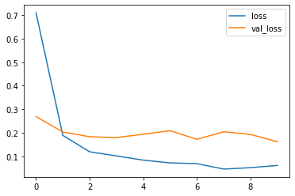

# 📝 Optical Character Recognition (OCR) Project

## 📌 Project Overview
This project implements **Optical Character Recognition (OCR)** using two approaches: **Pytesseract** for extracting text from images and a **deep learning CNN model** for recognizing individual letters and digits. The goal is to accurately extract and classify text from images, with the CNN model achieving a test accuracy of 98.51%.

---

## 📂 Dataset
- **Pytesseract**: Uses simple images with text in various languages supported by Tesseract.
- **CNN Model**: Custom dataset of images containing individual letters and digits, stored in `data/` with subfolders per character.

---

## 🔍 Project Workflow

### **1. Pytesseract OCR**
Extract text from images using Pytesseract with support for multiple languages.

```python
import pytesseract
import cv2

# Configure Tesseract path
pytesseract.pytesseract.tesseract_cmd = r'path_to_tesseract.exe'

# Supported languages
languages = ['afr', 'amh', 'ara', 'asm', 'aze', 'aze_cyrl', 'bel', 'ben', 'bod', 'bos', 'bre', 'bul', 'cat', 'ceb', 'ces', 'chi_sim', 'chi_sim_vert', 'chi_tra', 'chi_tra_vert', 'chr', 'cos', 'cym', 'dan', 'deu', 'div', 'dzo', 'ell', 'eng', 'enm', 'epo', 'equ', 'est', 'eus', 'fao', 'fas', 'fil', 'fin', 'fra', 'frk', 'frm', 'fry', 'gla', 'gle', 'glg', 'grc', 'guj', 'hat', 'heb', 'hin', 'hrv', 'hun', 'hye', 'iku', 'ind', 'isl', 'ita', 'ita_old', 'jav', 'jpn', 'jpn_vert', 'kan', 'kat', 'kat_old', 'kaz', 'khm', 'kir', 'kmr', 'kor', 'lao', 'lat', 'lav', 'lit', 'ltz', 'mal', 'mar', 'mkd', 'mlt', 'mon', 'mri', 'msa', 'mya', 'nep', 'nld', 'nor', 'oci', 'ori', 'osd', 'pan', 'pol', 'por', 'pus', 'que', 'ron', 'rus', 'san', 'sin', 'slk', 'slv', 'snd', 'spa', 'spa_old', 'sqi', 'srp', 'srp_latn', 'sun', 'swa', 'swe', 'syr', 'tam', 'tat', 'tel', 'tgk', 'tha', 'tir', 'ton', 'tur', 'uig', 'ukr', 'urd', 'uzb', 'uzb_cyrl', 'vie', 'yid', 'yor']

# Example: Extract text from an image
img = cv2.imread('test_image.jpg')
text = pytesseract.image_to_string(img, lang='eng')
print(text)
```

### **2. Data Preparation for CNN Model**
Load and preprocess images of letters and digits, resizing to 64x64 and normalizing.

```python
import cv2
import numpy as np
import os
from sklearn.preprocessing import LabelEncoder

images = []
labels = []
path = 'data'
for i in os.listdir(path):
    dir = os.path.join(path, i)
    for j in os.listdir(dir):
        files = os.path.join(dir, j)
        img = cv2.imread(files)
        img = cv2.resize(img, (64, 64))
        img = np.array(img, dtype=np.float32) / 255
        images.append(img)
        labels.append(i)

le = LabelEncoder()
y = le.fit_transform(labels)
```

### **3. CNN Model for Character Recognition**
Train a CNN to classify letters and digits.

```python
from tensorflow.keras.models import Sequential
from tensorflow.keras.layers import Conv2D, MaxPooling2D, Flatten, Dense

model = Sequential([
    Conv2D(filters=16, kernel_size=(3, 3), activation='relu', input_shape=(64, 64, 3)),
    MaxPooling2D(),
    Conv2D(filters=32, kernel_size=(3, 3), activation='relu'),
    MaxPooling2D(),
    Conv2D(filters=64, kernel_size=(3, 3), activation='relu'),
    MaxPooling2D(),
    Conv2D(filters=128, kernel_size=(3, 3), activation='relu'),
    Flatten(),
    Dense(units=128, activation='relu'),
    Dense(units=64, activation='relu'),
    Dense(units=36, activation='softmax')
])

model.compile(optimizer='adam', loss='sparse_categorical_crossentropy', metrics=['accuracy'])
model.fit(X_train, y_train, validation_split=0.1, epochs=50)
model.save('ocr_model.keras')
```

### **4. Model Evaluation**
Evaluate the CNN model and visualize results.

```python
test_loss, test_accuracy = model.evaluate(X_test, y_test)
print(f"Loss: {test_loss:.4f} - Accuracy: {test_accuracy:.4f}")
```

---

## 📊 Results
- **Pytesseract**: Extracts text from simple images with multilingual support.
- **CNN Model**: 
  - Test Loss: 0.0336
  - Test Accuracy: 0.9851 (~98.51%)
- **Loss Curve**:
  
- **Confusion Matrix**:
  
- **Model Output**:
  

---

## 📦 Requirements
```bash
pip install pytesseract opencv-python numpy tensorflow sklearn
```
- Install Tesseract OCR and set the executable path.

---

## ▶️ How to Run
1. Clone the repository:
   ```bash
   git clone https://github.com/ali27kh/OCR.git
   cd OCR
   ```
2. Install Tesseract OCR and dependencies.
3. Test it.

---

## 📌 Key Insights
- **Pytesseract** is effective for simple text extraction across multiple languages.
- The **CNN model** achieves high accuracy (98.51%) for letter and digit recognition.
- Preprocessing (resizing, normalization) ensures consistent input for the CNN.
- The confusion matrix highlights robust performance across character classes.

---

## 📜 License
MIT License
